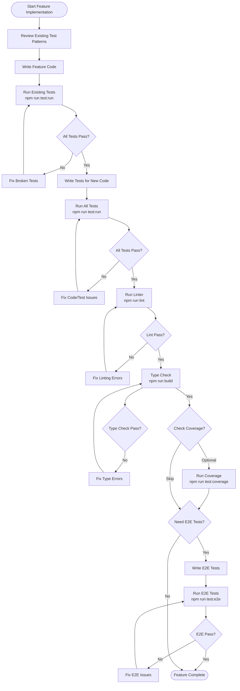

# Agent Testing Best Practices Guide

## Overview

This guide outlines best practices for AI agents (like Cursor AI) to run tests when implementing features in the open-event codebase.

## Testing Workflow

### 1. Pre-Implementation Phase

**Before writing code:**

- Review existing test patterns in the codebase
- Check if similar features have tests to follow as examples
- Understand the testing setup (Vitest, React Testing Library, Playwright)

**Key files to review:**

- `vitest.config.ts` - Test configuration
- `src/test/setup.ts` - Test setup and mocks
- Existing test files in the same directory/feature area

### 2. Implementation Phase

**While writing code:**

- Write code that is testable (avoid tight coupling, use dependency injection)
- Keep functions pure where possible
- Make components accept props for easy mocking

### 3. Post-Implementation Testing Phase

**After writing code, follow this sequence:**

#### Step 1: Run Unit Tests for Modified Files

```bash
# Run all tests
npm run test:run

# Or run specific test file
npx vitest run src/components/ui/button.test.tsx
```

**What to check:**

- All existing tests still pass
- New code doesn't break existing functionality
- If tests fail, fix them before proceeding

#### Step 2: Write Tests for New Code

**For new components:**

- Create `ComponentName.test.tsx` in the same directory
- Test user interactions, edge cases, and error states
- Follow existing patterns (see `src/components/auth/SignInForm.test.tsx` as example)

**For new utilities/hooks:**

- Create `utilityName.test.ts` in the same directory
- Test all public functions/methods
- Test edge cases and error handling

**Test structure to follow:**

```typescript
import { describe, it, expect, vi, beforeEach } from 'vitest'
import { render, screen } from '@testing-library/react'
import userEvent from '@testing-library/user-event'
import { YourComponent } from './YourComponent'

describe('YourComponent', () => {
  beforeEach(() => {
    vi.clearAllMocks()
  })

  it('should render correctly', () => {
    // Test basic rendering
  })

  it('should handle user interactions', async () => {
    // Test user events
  })

  it('should handle edge cases', () => {
    // Test error states, empty states, etc.
  })
})
```

#### Step 3: Run Tests Again

```bash
npm run test:run
```

**Verify:**

- All new tests pass
- No regressions in existing tests
- Test coverage is adequate

#### Step 4: Check Test Coverage (Optional but Recommended)

```bash
npm run test:coverage
```

**Review coverage report:**

- Aim for >80% coverage on new code
- Focus on critical paths (user flows, error handling)
- Don't obsess over 100% coverage

#### Step 5: Run Linter

```bash
npm run lint
```

**Fix any linting errors before proceeding**

#### Step 6: Type Check

```bash
npm run build
```

**Ensures TypeScript compilation succeeds**

### 4. E2E Testing (For Critical User Flows)

**For features that affect user flows:**

- Add E2E tests in `e2e/` directory
- Test complete user journeys
- Use Playwright for browser automation

```bash
# Run E2E tests
npm run test:e2e

# Or run with UI
npm run test:e2e:ui
```

## Test Types and When to Use Them

### Unit Tests (Vitest + React Testing Library)

**Use for:**

- Individual components
- Utility functions
- Custom hooks
- Business logic

**Example locations:**

- `src/components/**/*.test.tsx`
- `src/lib/**/*.test.ts`
- `src/hooks/**/*.test.ts`

### Integration Tests

**Use for:**

- Component interactions
- Form submissions
- API integration (mocked)

**Example:** `src/components/auth/SignInForm.test.tsx` tests form validation and submission

### E2E Tests (Playwright)

**Use for:**

- Complete user flows
- Critical paths (auth, event creation)
- Cross-browser testing

**Example:** `e2e/auth.spec.ts`, `e2e/landing.spec.ts`

## Handling Test Failures

### When Tests Fail

1. **Read the error message carefully**
   - Identify which test failed
   - Understand what was expected vs. what was received

2. **Check if it's a test issue or code issue**
   - Test issue: Test expectations don't match implementation
   - Code issue: Implementation has a bug

3. **Fix the root cause**
   - If test is wrong: Update test expectations
   - If code is wrong: Fix the implementation

4. **Re-run tests to verify fix**

### Common Test Failure Scenarios

**Scenario 1: Test expectations don't match implementation**

- **Action:** Update test to match actual behavior (if behavior is correct)
- **Example:** Button size changed from `h-9` to `h-10` - update test

**Scenario 2: Implementation changed but tests weren't updated**

- **Action:** Update tests to reflect new behavior
- **Example:** Component API changed, props renamed

**Scenario 3: New code broke existing functionality**

- **Action:** Fix the code, not the test
- **Example:** Changed a utility function that other code depends on

## Best Practices

### 1. Test Organization

- Keep test files next to source files
- Use descriptive test names
- Group related tests with `describe` blocks
- Use `beforeEach`/`afterEach` for setup/cleanup

### 2. Test Quality

- Test behavior, not implementation details
- Use `screen.getByRole` for accessibility
- Test user interactions, not internal state
- Mock external dependencies (APIs, modules)

### 3. Test Coverage Strategy

**High Priority:**

- User-facing features
- Critical business logic
- Error handling
- Edge cases

**Lower Priority:**

- Simple utility functions
- Trivial getters/setters
- Third-party library wrappers

### 4. Mocking Strategy

**Mock external dependencies:**

```typescript
// Mock icons
vi.mock('@phosphor-icons/react', () => ({
  IconName: () => <span data-testid="icon">Icon</span>
}))

// Mock API calls
vi.mock('@/lib/api', () => ({
  fetchData: vi.fn()
}))
```

**Use real implementations when:**

- Testing utility functions
- Testing pure functions
- Dependencies are simple and fast

### 5. Test Data

- Use realistic test data
- Test with edge cases (empty strings, null, undefined)
- Test with boundary values
- Use factories for complex test data

## Complete Testing Workflow

### Workflow Diagram

The following diagram illustrates the complete testing workflow for feature implementation:



### Step-by-Step Workflow

#### Phase 1: Preparation

1. **Review existing test patterns**
   - Look at similar features in the codebase
   - Understand testing conventions
   - Check `vitest.config.ts` for configuration
   - Review `src/test/setup.ts` for available mocks

#### Phase 2: Implementation

2. **Write the feature code**
   - Follow existing code patterns
   - Keep code testable (avoid tight coupling)
   - Use dependency injection where possible

#### Phase 3: Verification

3. **Run existing tests**

   ```bash
   npm run test:run
   ```

   - Ensures new code doesn't break existing functionality
   - Fix any failures before proceeding

4. **Write tests for new code**
   - Create test file next to source file
   - Follow existing test patterns
   - Test happy paths, edge cases, and error states

5. **Run all tests**

   ```bash
   npm run test:run
   ```

   - Verify new tests pass
   - Ensure no regressions

6. **Run linter**

   ```bash
   npm run lint
   ```

   - Fix any linting errors
   - Maintain code style consistency

7. **Type check**
   ```bash
   npm run build
   ```

   - Ensure TypeScript compilation succeeds
   - Fix any type errors

#### Phase 4: Quality Assurance (Optional)

8. **Check test coverage** (Optional)

   ```bash
   npm run test:coverage
   ```

   - Review coverage report
   - Aim for >80% on new code
   - Focus on critical paths

9. **Add E2E tests** (For critical user flows)
   ```bash
   npm run test:e2e
   ```

   - Test complete user journeys
   - Verify critical paths work end-to-end

## Workflow Checklist

When implementing a feature, follow this checklist:

- [ ] Review existing test patterns
- [ ] Write the feature code
- [ ] Run existing tests: `npm run test:run`
- [ ] Fix any broken tests
- [ ] Write tests for new code
- [ ] Run all tests: `npm run test:run`
- [ ] Verify all tests pass
- [ ] Run linter: `npm run lint`
- [ ] Run type check: `npm run build`
- [ ] (Optional) Check coverage: `npm run test:coverage`
- [ ] (For critical flows) Add E2E tests

## Quick Reference Commands

```bash
# Run all unit tests
npm run test:run

# Run tests in watch mode (during development)
npm test

# Run with coverage
npm run test:coverage

# Run E2E tests
npm run test:e2e

# Run E2E with UI
npm run test:e2e:ui

# Lint code
npm run lint

# Type check
npm run build
```

## Example: Adding a New Feature

**Scenario:** Adding a new `EventCard` component

1. **Create component:** `src/components/dashboard/EventCard.tsx`
2. **Run existing tests:** `npm run test:run` ✅
3. **Create test file:** `src/components/dashboard/EventCard.test.tsx`
4. **Write tests:**
   - Render with props
   - Handle click events
   - Display event information
   - Handle loading/error states
5. **Run tests:** `npm run test:run` ✅
6. **Run linter:** `npm run lint` ✅
7. **Type check:** `npm run build` ✅
8. **Done!**

## Real Examples from Codebase

### Example 1: Component Test (SignInForm)

**File:** `src/components/auth/SignInForm.test.tsx`

**Key patterns demonstrated:**

```typescript
// Mock external dependencies
vi.mock('@phosphor-icons/react', () => ({
  SignIn: () => <span data-testid="sign-in-icon">SignIn</span>,
  Eye: () => <span data-testid="eye-icon">Eye</span>,
}))

// Setup mocks in beforeEach
beforeEach(() => {
  vi.clearAllMocks()
})

// Test user interactions with userEvent
it('should call onSubmit with valid credentials', async () => {
  render(<SignInForm onSubmit={mockOnSubmit} />)
  const user = userEvent.setup()

  const emailInput = screen.getByLabelText(/email/i)
  await user.type(emailInput, 'test@example.com')

  const passwordInput = screen.getByPlaceholderText(/enter your password/i)
  await user.type(passwordInput, 'password123')

  const submitButton = screen.getByRole('button', { name: /sign in/i })
  await user.click(submitButton)

  await waitFor(() => {
    expect(mockOnSubmit).toHaveBeenCalledWith({
      email: 'test@example.com',
      password: 'password123',
    })
  })
})
```

**Takeaways:**

- Form validation testing
- User interaction testing with `userEvent`
- Mock setup and cleanup
- Async behavior testing with `waitFor`
- Accessibility-first queries (`getByRole`, `getByLabelText`)

### Example 2: Utility Test (utils)

**File:** `src/lib/utils.test.ts`

**Key patterns demonstrated:**

```typescript
describe('cn utility', () => {
  it('should merge simple class names', () => {
    const result = cn('foo', 'bar')
    expect(result).toBe('foo bar')
  })

  it('should handle conditional classes', () => {
    const isActive = true
    const isDisabled = false
    const result = cn('base', isActive && 'active', isDisabled && 'disabled')
    expect(result).toBe('base active')
  })

  it('should merge conflicting Tailwind classes', () => {
    const result = cn('px-4 py-2', 'px-6')
    expect(result).toBe('py-2 px-6')
  })
})
```

**Takeaways:**

- Pure function testing (no setup needed)
- Edge case handling (null, undefined, arrays, objects)
- Complex logic testing (Tailwind class merging)
- Simple, focused test cases

### Example 3: Hook Test (use-audience-toggle)

**File:** `src/hooks/use-audience-toggle.test.ts`

**Key patterns demonstrated:**

```typescript
describe('useAudienceToggle', () => {
  beforeEach(() => {
    localStorage.clear()
    vi.clearAllMocks()
  })

  afterEach(() => {
    localStorage.clear()
  })

  it('should return organizer as default audience', () => {
    const { result } = renderHook(() => useAudienceToggle())
    expect(result.current.audience).toBe('organizer')
  })

  it('should persist audience to localStorage', () => {
    const { result } = renderHook(() => useAudienceToggle())

    act(() => {
      result.current.setAudience('developer')
    })

    expect(localStorage.getItem('open-event-audience')).toBe('developer')
  })
})
```

**Takeaways:**

- Custom hook testing with `renderHook`
- LocalStorage testing with cleanup
- State management testing
- Using `act` for state updates
- Testing side effects

### Example 4: Agent Component Test (ToolExecutionCard)

**File:** `src/components/agent/ToolExecutionCard.test.tsx`

**Key patterns demonstrated:**

```typescript
describe('ToolExecutionCard', () => {
  const mockToolCall = {
    toolCallId: 'test-id',
    toolName: 'createEvent',
    args: { name: 'Test Event' },
    status: 'running' as const,
  }

  it('should render tool name and status', () => {
    render(<ToolExecutionCard toolCall={mockToolCall} />)
    expect(screen.getByText(/createEvent/i)).toBeInTheDocument()
    expect(screen.getByText(/running/i)).toBeInTheDocument()
  })

  it('should handle different status states', () => {
    const { rerender } = render(
      <ToolExecutionCard toolCall={{ ...mockToolCall, status: 'success' }} />
    )
    expect(screen.getByText(/success/i)).toBeInTheDocument()

    rerender(
      <ToolExecutionCard toolCall={{ ...mockToolCall, status: 'error' }} />
    )
    expect(screen.getByText(/error/i)).toBeInTheDocument()
  })
})
```

**Takeaways:**

- Complex component state testing
- Multiple prop variations
- Conditional rendering tests
- Testing component updates with `rerender`
- Testing different component states

### Example 5: E2E Test (Authentication Flow)

**File:** `e2e/auth.spec.ts`

**Key patterns demonstrated:**

```typescript
import { test, expect } from '@playwright/test'

test.describe('Authentication', () => {
  test('should sign in with valid credentials', async ({ page }) => {
    await page.goto('/sign-in')

    await page.fill('[name="email"]', 'test@example.com')
    await page.fill('[name="password"]', 'password123')
    await page.click('button[type="submit"]')

    await expect(page).toHaveURL('/dashboard')
    await expect(page.locator('text=Welcome')).toBeVisible()
  })
})
```

**Takeaways:**

- Complete user flow testing
- Browser automation
- URL and element visibility assertions
- Real user interaction simulation

## Key Takeaways

1. **Always run tests after making changes** - Catch regressions early
2. **Write tests for new code** - Maintain code quality
3. **Fix failing tests immediately** - Don't let them accumulate
4. **Follow existing patterns** - Consistency is key
5. **Test user behavior, not implementation** - Tests should be maintainable
6. **Use appropriate test types** - Unit for logic, E2E for flows

## Resources

- [Vitest Documentation](https://vitest.dev/)
- [React Testing Library](https://testing-library.com/react)
- [Playwright Documentation](https://playwright.dev/)
- Existing test files in codebase for examples:
  - `src/components/auth/SignInForm.test.tsx`
  - `src/lib/utils.test.ts`
  - `src/hooks/use-audience-toggle.test.ts`
  - `src/components/agent/ToolExecutionCard.test.tsx`
